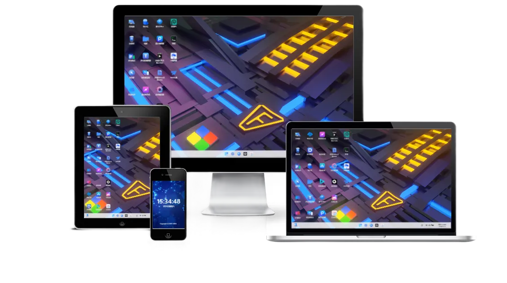

# webos-auto-sync
自动构建星芸webos
# 为什么使用星芸 **Webos**？

> Webos：意为 **网页;os系统**。
>
> 是一个支持多种存储、协同办公新体验的Web系统，如Win11般体验的私有云盘！
>
> 官网地址：[点我进入官网](https://webos.cloud/)

## Webos 是什么？

星芸WebOS是一个基于Web技术的操作系统，它允许用户通过浏览器访问和操作计算机资源。与传统的桌面操作系统不同，星芸WebOS是基于云计算技术的，这意味着用户无需在本地安装软件或应用程序，只需通过互联网连接即可使用各种服务和应用。同时支持挂载oss 三方网盘等。

 

- **客户端**：支持 Windows、Linux、MAC 。
- **移动端**：H5、小程序、安卓、IOS（待开发）、鸿蒙（待开发）。
- **服务端**：服务端支持在 Docker、Windows、Linux、MAC、宝塔、群辉和 ARM 架构的设备，以及其它移动设备部署。

> **提示**  
> 如果你想尝试一下，可以查看[试用](https://pan.webos.cloud/?toLoginNo=10001&toLoginUser=demo&toLoginPassword=123456)。

## 为什么选择 Webos？

一体化办公平台，在线编辑各类文档、实时协作分享、流程图、绘图、音频、视频、文档、看板、表格、资源库等多种创意工作和内容；支持每一个参与者自由挥洒自己的创意。

### 不一样的私有云

Webos-私有云是一款极致美观强大的私有云web系统，TA能满足您所有在线办公，文件分享，私有存储等需求！

### 完善的强大功能

TA所拥有的一切，也是您的业务所需的一切！

|   | 功能 | 描述 |
|---|------|------|
| 💖 | 个性化 | 壁纸，动态壁纸 |
| 💖 | 第三方登录 | 支持微信、QQ等三方登录 |
| 💖 | 离线下载 | 无需前端 实现离线下载 |
| 💖 | 文件管理器 | 删除、mkdir、重命名、移动/复制/剪切/粘贴/共享 |
| 💖 | 全盘断点续传 | 意外断网,刷新,重新在同一个目录选同一个文件能接着传 |
| 💖 | 跨盘秒传 | 任意盘之间复制粘贴会检测是否支持,不支持采用先下载再上传 |
| 💖 | 文件编辑预览 | 文本,代码,文档,图片等在线编辑和预览,后面会支持更多 |
| 💖 | 直连上传/下载 | 盘支持从浏览器直接上传/下载到服务器,不经过中转 |
| 💖 | 独立的应用商店 | 可下载应用插件、后期可注册开发者发布自己制作的插件 |
| 💖 | 永久直连 | 文件永久链接复制和直接文件下载 |
| 💖 | 全盘文件分享 | 权限管控,可控制是否允许下载 |
| 💖 | 用户权限管控 | 更细粒的权限分配 |
| 💖 | 日志 | 各类操作日志 |
| 💖 | 注册 | 允许用户自行注册，默认分配空间 |
| 💖 | 云协作 | 各类文档，协作 |
| 💖 | 音视频 | 在线打开各类音视频文件 |
|   | **高级功能** | **描述** |
| 💖 | 通知管理 | 允许发送用户信息 |
| 💖 | 企业模式 | 企业模式框架，更好的管理部门及用户 |
| 💖 | 自营模式 | 内测中 |
| 💖 | 屏蔽版权信息 | 屏蔽所有版权信息，让Webos为个人所有 |
| 💖 | 全局JS，ccs | 全局代码功能 |
| 💖 | 共享上传 | 允许用户无需登录上传文件,多用于收集文件 |
| 💖 | 自定义广告管理 | 允许用户自行设置系统内的广告 |
| 💖 | 内网穿透 | 无需外网在任意环境下访问您的webos |
| 💖 | 内网映射 | 内网设备通过webos访问 |
| 💖 | VIP专属群 | 优先响应反馈的信息及建议 |
| 💖 | 本地同步 | 本地文件自动同步到webos或挂载的网盘内 |
| 💖 | 跨盘同步 | 任意网盘之间相互同步，支持秒传协议 |
| 💖 | 动态登录壁纸 | 登录注册页面允许设置视频为壁纸 |

> **其它详细功能**

- 历史版本，历史回溯,保证文件安全；
- 提供两种风格，并支持默认，仿Win11及网盘模式；
- *常用* 支持各类文档在线编辑预览, excel, word, pdf, PPT, TXT, md等；
- 所有功能支持局部开启/关闭，显示/隐藏，修改/添加；
- 强大的管理系统，无需修改任何代码，自定义所有设置；
- 强大的挂载功能，可自定义挂载网盘及oss等；
- 支持三端访问；
- 支持网盘模式；
- 支持插件安装；
- 支持插件扩展；
- 支持系统默认本地磁盘；
- 支持应用商店安装插件；
- 支持SMTP邮箱功能,用户注册,找回密码等场景需求；
- 支持引用文件,嵌入功能；
- 支持自定义网站Logo图片、网站Favicon图标；
- 支持网站自定义全局JS代码、自定义css样式；
- 支持自定义应用；
- 支持自定义插件；
- 支持用户注册登录；
- 支持可选表单注册登录及第三方社交帐号注册登录（QQ 微信 ）；
- 支持自定义壁纸及视频壁纸；
- 支持自定义登录壁纸及视频壁纸；
- 支持创建文件；
- 支持创建文件夹；
- 支持在线编辑预览；
- 支持协作编辑；
- 支持文件、文件夹分享可设置是否收费；
- 支持权限管理 用户权限 下载权限；
- 支持企业组织架构设置；
- 支持文件收集功能；
- 支持右键菜单设置；
- 支持广告管理 允许设置是否弹窗；
- 支持创建快捷方式；
- 支持锁定任务栏；
- 支持创建标签；
- 支持各网盘回收站功能,无需网盘支持；
- 支持ssh终端,无需配置直接内网访问；
- 支持离线下载,后续增加更多；
- 支持自动备份；
- 支持跨盘同步，各大网盘之间相互同步,支持秒传；
- 支持本地同步，同步到云端,三方网盘；
- 支持保险箱，独立加密,让文件更安全；

**支持挂载的网盘**

| 推荐指数 | 挂载网盘 | 描述 |
|---|---|---|
| ⭐️⭐️⭐️⭐️⭐️ | 阿里云盘 | 扫码/验证码/账号登录,直连上传,直连下载 支持秒存 |
| ⭐️⭐️⭐️⭐️⭐️ | 天翼云盘 | 扫码登录,直连上传,直连下载 |
| ⭐️⭐️⭐️⭐️⭐️ | 百度云盘 | 扫码/验证码/账号登录,无缓存中转上传,直连下载（**无需会员 支持不限速下载**） |
| ⭐️⭐️⭐️ | 夸克网盘 | 扫码登录,直连上传,直连下载 |
| ⭐️⭐️⭐️⭐️ | 123云盘 | 账号登录,直连上传,直连下载 |
| ⭐️⭐️⭐️⭐️⭐️ | 本地磁盘 | 双模式:秒传模式/常规模式 |
| ⭐️⭐️⭐️⭐️ | OneDrive | 扫码,验证码,账号登录,无缓存中转上传,直连下载 |
| ⭐️⭐️⭐️⭐️ | Cloudreve | 扫码,验证码,账号登录,无缓存中转上传,直连下载 |
| ⭐️⭐️⭐️⭐️ | 一刻相册 | 支持上传任意格式文件，直连上传下载，（非会员默认30mb） |
| ⭐️⭐️⭐️⭐️ | WebDav | 对系统中进行挂载,可以挂载到本地磁盘 |
| ⭐️⭐️⭐️⭐️⭐️ | Alist | 支持挂载本地,无账号挂载（输入网址即可无需账号密码） |
| ⭐️⭐️⭐️⭐️⭐️ | 可道云 | 账号登录,无缓存中转上传,直连下载 |
| ⭐️⭐️⭐️⭐️⭐️ | 七牛云 | 账号登录,直连上传,直连下载 |
| ⭐️⭐️⭐️⭐️ | 小龙云 | 账号登录,直连上传,直连下载（已修复） |
| ⭐️⭐️⭐️⭐️⭐️ | 115网盘 | 扫码/验证码/账号登录,直连上传,直连下载 支持秒存 |
| ⭐️⭐️⭐️ | 迅雷网盘 | 扫码/验证码/账号登录,直连上传,直连下载 支持秒存 |
| ⭐️⭐️⭐️⭐️⭐️ | 阿里OSS | 扫码/验证码/账号登录,直连上传,直连下载 支持秒存 |
| ⭐️⭐️⭐️⭐️⭐️ | 腾讯cos | 扫码/验证码/账号登录,直连上传,直连下载 支持秒存 |
| ⭐️⭐️⭐️ | Amazon S3 | 中转上传,直连下载 |
| ⭐️⭐️⭐️⭐️ | FTP | 已支持,取决于服务器 |
| ⭐️⭐️⭐️⭐️ | SMB | 已支持,取决于服务器 |
| ⭐️⭐️⭐️⭐️ | 移动云盘 | 账号登录,中转上传,直连下载 |
| ⭐️⭐️⭐️ | 曲奇网盘 | 待增加...... |
| ⭐️⭐️⭐️⭐️ | PIKPAK | 账号登录,中转上传,直连下载 |
| ⭐️⭐️⭐️⭐️ | 谷歌云盘 | 账号登录,中转上传,直连下载 |
| ⭐️⭐️⭐️ | 腾讯微云 | 账号登录,中转上传,直连下载 |
| ⭐️⭐️⭐️⭐️ | 蓝奏云 | 账号登录,中转上传,直连下载 |
| ⭐️⭐️⭐️⭐️ | 又拍云 | 账号登录,直连上传,直连下载 |

### **无限制授权**

随时服务器更换,无需担心授权问题,支持绑定QQ 微信等

### API

Webos 还提供了后台访问接口 API 接口，如果你是开发者，也可以通过 API 来开发插件分享到社区或小伙伴赚取佣金。
